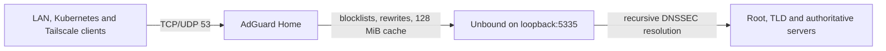

# AdGuard Home + Unbound: my DNS setup

This is a sanitized description of a small home-lab DNS stack, checked against the running services on 2026-09-24. Replace every `<PLACEHOLDER>` with your own addresses and domain. It is a description of what I run, not a drop-in copy of my protected configuration.

## Architecture



The DNS container has 2 vCPU and 2 GiB RAM. AdGuard Home `v0.107.79` and Unbound `v1.26.1` are installed as native systemd services, both enabled and running. AdGuard listens on its LAN address and loopback for plain DNS; its management UI listens on a separate LAN port behind a private reverse proxy. Unbound is reached only over loopback. There is no Docker or public DNS listener.

Clients use the AdGuard LAN IP. The router and infrastructure point to it as primary DNS; a public resolver may be configured as a *client-side* fallback, but that can bypass local names and filtering when selected. AdGuard itself has **no fallback upstream**: recursive queries go to Unbound. The public bootstrap resolvers in the AdGuard settings are for resolving hostname-based encrypted upstreams if needed; they are not the normal recursive path.

## AdGuard Home settings

These are the relevant, sanitized fields from `/opt/AdGuardHome/AdGuardHome.yaml`:

```yaml
http:
  address: <DNS_LAN_IP>:3000
dns:
  bind_hosts:
    - 127.0.0.1
    - <DNS_LAN_IP>
  port: 53
  upstream_dns:
    - 127.0.0.1:5335
  fallback_dns: []
  allowed_clients:
    - 127.0.0.0/8
    - <LAN_CIDR>
    - <K8S_POD_CIDR>
    - <TAILSCALE_CIDR>
  ratelimit: 100
  refuse_any: true
  cache_enabled: true
  cache_size: 134217728 # 128 MiB, in bytes
  cache_ttl_min: 0
  cache_ttl_max: 0
  cache_optimistic: true
  cache_optimistic_answer_ttl: 30s
  cache_optimistic_max_age: 12h
  enable_dnssec: true
  edns_client_subnet:
    enabled: false
querylog:
  enabled: true
  interval: 7d
statistics:
  enabled: true
  interval: 90d
tls:
  enabled: false
```

The zero TTL overrides mean authoritative TTLs are respected; the cache does not forcibly extend every record. Optimistic caching can answer from an expired AdGuard entry while refreshing it, for up to the configured maximum age. This favors availability and latency, but a recently changed DNS record can briefly appear stale. DNSSEC validation is also performed by Unbound. DNS-over-TLS/HTTPS is not exposed directly by AdGuard; the admin UI is protected separately by the reverse proxy. I do not publish the active YAML because it also contains an administrator password hash and operational state.

### Blocklists

Only two general-purpose lists are enabled, to avoid stacking heavily overlapping lists:

| Purpose | List | URL |
| --- | --- | --- |
| General ads, trackers and nuisance domains | HaGeZi Multi PRO | `https://cdn.jsdelivr.net/gh/hagezi/dns-blocklists@latest/adblock/pro.txt` |
| Threat intelligence / malicious domains | HaGeZi TIF Medium | `https://cdn.jsdelivr.net/gh/hagezi/dns-blocklists@latest/adblock/tif.medium.txt` |

I use the default blocking mode, with no custom allowlist or user rules in the shared baseline. DNS blocking is not a substitute for endpoint/browser security, and the aggressive HaGeZi Pro++ or Ultimate tiers are not automatically “better” for a mixed-device household: false positives and support effort matter more than available RAM.

### Local DNS and split horizon

An apex A rewrite points `<INTERNAL_DOMAIN>` to `<PROXY_LAN_IP>`, and a wildcard CNAME rewrite points `*.<INTERNAL_DOMAIN>` back to that apex. New reverse-proxy services therefore need a proxy route but usually no new local DNS record. A few direct-host names use AdGuard CNAME exceptions and exact A records in Unbound instead. Public DNS is private-by-default; only explicitly published names receive public A records. Keep direct-host, SMB and management names private.

## Unbound: complete current config and a reproducible example

Unbound is the **recursive resolver**, not a forwarder to a public DNS provider. The running process answers on `127.0.0.1:5335`, and its Debian systemd unit is enabled. These are all of the current on-disk Unbound files, with only the domain and host details replaced:

`/etc/unbound/unbound.conf`:

```unbound
include-toplevel: "/etc/unbound/unbound.conf.d/*.conf"
```

`/etc/unbound/unbound.conf.d/remote-control.conf`:

```unbound
remote-control:
    control-enable: yes
    control-interface: /run/unbound.ctl
```

`/etc/unbound/unbound.conf.d/root-auto-trust-anchor-file.conf`:

```unbound
server:
    auto-trust-anchor-file: "/var/lib/unbound/root.key"
```

`/etc/unbound/unbound.conf.d/homelab.conf` (there are several direct-host `local-data` lines; this shows the complete pattern without my private inventory):

```unbound
server:
    local-zone: "<INTERNAL_DOMAIN>." transparent
    local-data: "<DIRECT_HOST_1>.<INTERNAL_DOMAIN>. 30 IN A <HOST_1_LAN_IP>"
    local-data: "<DIRECT_HOST_2>.<INTERNAL_DOMAIN>. 30 IN A <HOST_2_LAN_IP>"
```

**Important live/on-disk drift:** None of those files declares `interface: 127.0.0.1`, `port: 5335`, or custom caches. Socket inspection confirms that the already-running process is on 5335, but the current config query reports Unbound defaults: port 53, 4 MiB message cache, 4 MiB RRset cache, `prefetch: no`, `serve-expired: no`, one configured thread, and qname minimisation/DNSSEC validation enabled. A reload log says the process continued with two threads because of existing `so-reuseport` state. Thus the process state is **not reproducible from these files**; a cold restart may fail to bind as expected or conflict with AdGuard on port 53. I did not restart or modify it for this write-up.

For someone building the same architecture afresh, the missing persistent settings should go into a separate file such as `/etc/unbound/unbound.conf.d/recursive.conf`. The following is a **recommended example, not a claim about my currently installed file** for a two-core, 2 GiB DNS guest with AdGuard's 128 MiB cache:

```unbound
server:
    interface: 127.0.0.1
    port: 5335
    access-control: 127.0.0.0/8 allow
    num-threads: 2
    so-reuseport: yes
    msg-cache-size: 32m
    rrset-cache-size: 64m
    cache-min-ttl: 0
    cache-max-ttl: 86400
    prefetch: yes
    serve-expired: no
    qname-minimisation: yes
    hide-identity: yes
    hide-version: yes
```

Keep the Debian root trust-anchor file above for DNSSEC. `prefetch` refreshes popular near-expiry cache entries; I would leave Unbound's own `serve-expired` off because AdGuard already has optimistic caching. These cache sizes are a starting budget, not a universal maximum; watch memory and cache hit rate. Before applying a new file, run `unbound-checkconf`, ensure port 5335 is reachable only on loopback, and plan a restart test when DNS clients have a working fallback.

## Operational checks

```sh
systemctl is-enabled AdGuardHome unbound
systemctl is-active AdGuardHome unbound
ss -lntup | grep -E ':(53|5335)\b'
dig @<DNS_LAN_IP> example.org A
dig @127.0.0.1 -p 5335 example.org A
unbound-control stats_noreset | grep -E 'total.num.(queries|cachehits|cachemiss)='
```

Keep the management UI off the open Internet, limit DNS clients to intended networks, and monitor resolution after reboots—not just while the services happen to be running.

Official references: [AdGuard Home configuration](https://github.com/AdguardTeam/AdGuardHome/wiki/Configuration), [Unbound configuration manual](https://unbound.docs.nlnetlabs.nl/en/latest/manpages/unbound.conf.html).
